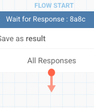
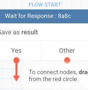
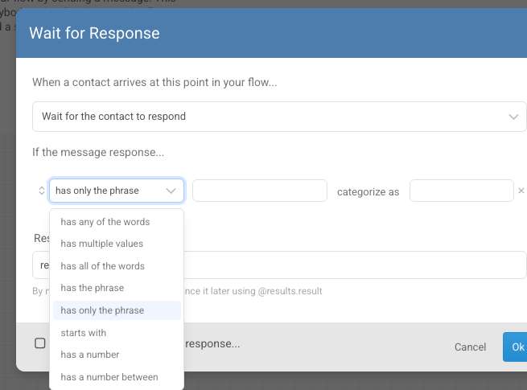
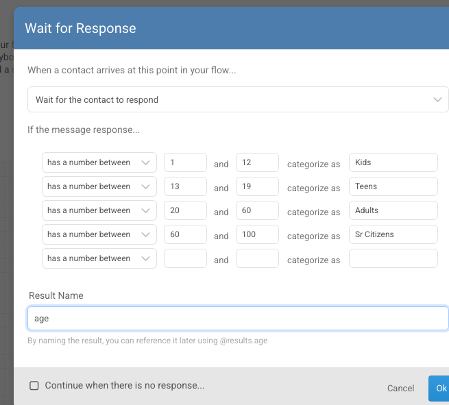
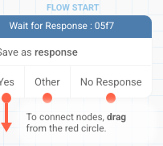

<h3>
  <table>
    <tr>
      <td><b>5 minutes read</b></td>
      <td style={{ paddingLeft: 40 }}><b> Level: Beginner</b></td>
      <td style={{ paddingLeft: 40 }}><b>Last Updated: October 2025</b></td>
    </tr>
  </table>
</h3>

# Wait for the contact to respond 

The Wait for Response node is used whenever the flow needs to pause and collect an answer from the end user. It ensures the conversation continues only after the contact replies, making it useful for registrations, surveys, quizzes, and feedback collection.

Once the response is received, it can be validated, stored in a variable, and reused later in the same flow or across different flows.

Note: the contact variable can be used across flows, but the result variable is limited to the same flow.

---

## Why use Wait for Response?

The Wait for Response node is essential whenever a flow needs input from the contact. Common use cases include:
- Gathering registration details (e.g., name, age, email).
- Conducting surveys or quizzes.
- Collecting feedback or applications.
- Capturing media, files, or location details.

## How to configure

**1. Insert a Wait for Response node in your flow.**

**2. Select a Response Type from the dropdown.**

**3. Give a Result Name (this becomes your variable).**

**4. (Optional) Check Continue when there is no response to nudge the users to respond.**

**5. Save the node(click on Ok).**

---

## Understanding the fields in this node

The Wait for Response node has a few blank fields you need to fill in. Here is what each one means:

- **Response criteria dropdown** (shows "has only the phrase" by default): choose how the contact's reply should be checked, for example "has any of the words" or "has a number". See Response Types below for the full list.
- **Value box** (next to the criteria dropdown): the word, phrase, or number the contact's reply is checked against. Some criteria, like "has a number" or "has an email", don't need a value here since they check the type of reply instead of specific text.
- **Categorize as**: the label given to this branch. This becomes the name of the exit point you connect the rest of your flow to, so use something that describes the outcome, like "Yes" or "Has Number".
- **Multiple criteria rows**: you can add more than one row of criteria. Each row becomes its own branch, so a reply can be routed differently depending on which criteria it matches.
- **Result Name**: the variable the contact's reply is saved under. Once named, you can reuse the reply later with `@results.<result_name>`, for example `@results.age`.
- **Continue when there is no response for**: optional. Lets the flow move on if the contact never replies, instead of waiting forever. See Handling no response below for details.

**The Other branch**

If you leave every criteria row blank, the node has a single **All Responses** branch that accepts any reply.

As soon as you fill in at least one criteria row, an automatic **Other** branch is added alongside it, for replies that don't match any of your rows.

---

## Response Types

## Text-based responses

### 1. has any of the words

This option accepts the input if it contains any of the words defined in the response criteria. Multiple words can be added, separated by commas. For example, if the criteria include Yes, Y, Ya, Yup, then any of these responses will be treated as valid.
Also, if the field is left blank, any text response from the user will be accepted.

### 2. has multiple values

This option accepts the input only if every word in it is one of the words defined in the response criteria. Unlike "has all of the words," it does not require every listed word to be present — the reply just cannot contain anything outside the list.
For example, if the criteria include red, blue, green, then "red blue" and "green" will be treated as valid, but "red yellow" will not, since yellow is not in the list.

### 3. has all of the words

This option accepts the input if it contains all of the words defined in the response criteria, in any order. The input can also contain other words besides the ones listed.
For example, if the criteria include cat, dog, then "I have a dog and a cat" will be treated as valid, but "I have a dog" will not, since it is missing cat.

### 4. has the phrase

This option accepts the input if it contains the exact phrase defined in the response criteria, with the words in that same order, anywhere in the message. The input can have other words before or after the phrase.
For example, if the criterion is customer support, then "I need customer support please" will be treated as valid, but "I need support from a customer" will not, since the words are not in that order.

### 5. has only the phrase

This option accepts the input only if it matches the response criteria exactly, with nothing else added.
For example, if the criterion is yes please, then "yes please" will be treated as valid, but "yes please now" will not, since it has an extra word.

### 6. starts with

This option accepts the input only if it begins with the exact text defined in the response criteria.
For example, if the criterion is order, then "order 123" will be treated as valid, but "my order is 123" will not, since it does not start with "order".

---

## Numeric responses

### 1. Has a number

Accepts any numeric input as a valid response. Any non-numeric input is treated as invalid.
In the example below, a numeric reply is categorized as "Has Number" and saved under the result name registration_number, so it can be reused later as `@results.registration_number`.

### 2. has a number between

Accepts input only if it is numeric and falls within the defined range. Any number outside the range is treated as invalid.
In the example below, four ranges are set up under the result name age: 1-12 is categorized as Kids, 13-19 as Teens, 20-60 as Adults, and 60-100 as Sr Citizens. A reply of 15 would be categorized as Teens, while a reply of 45 would be categorized as Adults.

:::note
The Adults and Sr Citizens ranges both include 60. When ranges overlap like this, a reply always matches the first matching row in the list — so a reply of exactly 60 is categorized as Adults, not Sr Citizens. To avoid this, use ranges that don't share a boundary number (for example, 20-59 and 60-100).
:::

### 3. has a number equal to

Accepts input only if it exactly matches the defined number. Any other number is treated as invalid.
In the example below, three separate cases are set up under the result name currency: 10, 20, and 50. A reply of 20 matches only the second case and is categorized as "20". A reply of 15 would not match any case and would be treated as invalid.

---

## Contact details

### 1. has a phone number

Accepts input if the response is a valid phone number. This includes mobile and landline numbers.

Supported formats include:
- 10-digit mobile number (XXXXXXXXXX).
- 10-digit mobile number with 0 prefix (0XXXXXXXXXX).
- 10-digit mobile number with country code prefix (+91 XXXXXXXXXX).
- Landline number (XXX XXXXXXX).
- Landline number with 0 and state code (0XXX XXXXXXX).
- Landline number with country code prefix (+91 XXX XXXXXXX).

In the example below, this is categorized as "Has Phone" and saved under the result name phone, so it can be reused later as `@results.phone`.

### 2. has an email

Accepts input if the response is a valid email address.
Examples: priya@example.org, contact.team@example.co.in, user+alerts@example.com

In the example below, this is categorized as "Has Email" and saved under the result name email, so it can be reused later as `@results.email`.

---

## Media responses

### 1. has media

Accepts input if the response is a media file (jpeg, png, mp4).

To store the media file, create a result variable (in the example below, picture is given as the result name).

In this example, the syntax for the media file URL is: `@results.picture.url`

### 2. has audio

Accepts input if the response is an audio file.

To store the audio file, create a result variable (in the example below, audio is given as the result name).
In this example, the syntax for the audio file URL is: `@results.audio.url`

### 3. has video

Accepts input if the response is a video file (mp4 video files).

To store the video file, create a result variable (in the example below, video is given as the result name).
In this example, the syntax for the video file URL is: `@results.video.url`

### 4. has image

Accepts input if the response is an image file (jpeg, png).

To store the image file, create a result variable (in the example below, image is given as the result name).
In this example, the syntax for the image file URL is: `@results.image.url`

### 5. has file

Accepts input if the response is a document (pdf, doc).

To store the file, create a result variable (in the example below, file is given as the result name).
In this example, the syntax for the file URL is: `@results.file.url`

---

## Location

### 1. has location

Accepts input if the response is a location.

- The location is saved as longitude and latitude.
- In the example below, location is given as the result name.
- You can reuse these values elsewhere in the flow. In this example, the syntax is:
  - for the longitude: `@results.location.longitude`
  - for the latitude: `@results.location.latitude`

To get the detailed location details using webhook - refer to this [document](https://glific.github.io/docs/docs/Integrations/Google%20Maps%20API%20for%20reverse%20geo%20location/)

---

## Matches Regex

This option is used to validate a response against a specific format using a regular expression (regex).
It is especially useful when inputs need to follow strict patterns, such as dates, ID numbers, or custom codes.

Example: to ensure a date of birth is entered in the format DD/MM/YYYY, use the following regex:
`^(0[1-9]|[12][0-9]|3[01])/(0[1-9]|1[0-2])/[0-9]{4}$`

Valid responses include 05/09/1995 and 31/12/2000.

In the example below, this is categorized as "correct format" and saved under the result name dob, so it can be reused later as `@results.dob`.

---

## Handling no response

If a contact does not respond, you can configure the flow to continue after a set wait time, instead of waiting forever.

Tick **Continue when there is no response for** and choose the time gap after which the flow should move on. In the example below, a reminder is sent to the end user every hour, up to 3 times, if no response is received.

To repeat a reminder like this, connect the no-response path to another Wait for Response node with its own timer, and connect that node's no-response path the same way for each additional reminder you want to send — three nodes chained this way gives you the three reminders in the example above. There's no automatic counter: the number of reminders is simply the number of nodes you connect. See "The no-response branch in your flow" below for what this branch looks like on the canvas.

---

## The no-response branch in your flow

Once you save a Wait for Response node with "Continue when there is no response for" ticked, an extra **No Response** branch appears on the canvas alongside your other criteria branches. You connect the rest of your flow to it the same way you would any other branch: drag from its red circle to the next node.

In the example below, the node has one criteria branch (**Yes**), an automatic **Other** branch for replies that do not match any criteria, and the **No Response** branch for when the contact does not reply in time.

:::note
**Other** and **No Response** are not the same thing. **Other** fires when the contact replies with something that does not match any of your criteria. **No Response** fires only when the contact does not reply at all within the time you set.
:::
